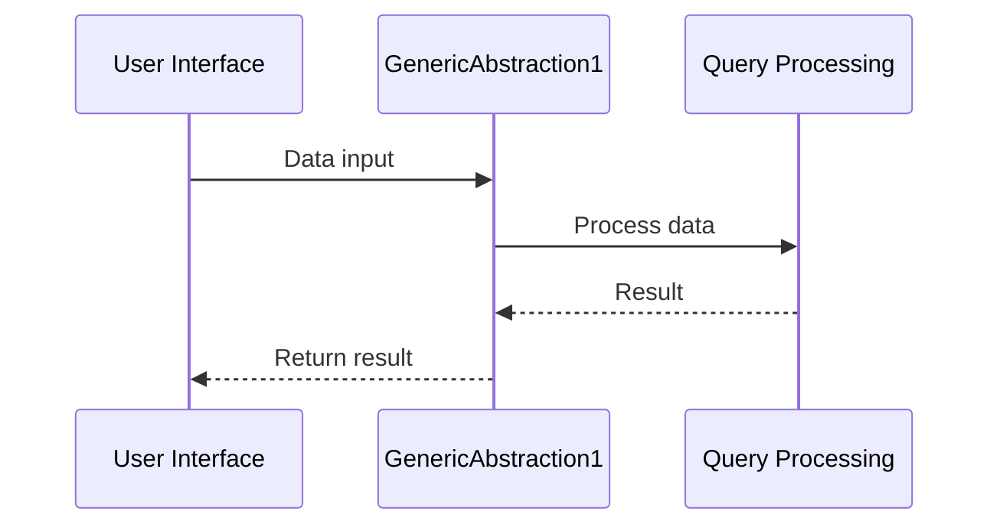

# Chapter 1: GenericAbstraction1

This is the first chapter in our tutorial series for the project `fusenlink`.

---

In the previous chapter, we introduced the `fusenlink` project and set the stage for our exploration of different core abstractions within the system.

## Understanding GenericAbstraction1

Imagine you have a magical toolbox with generic tools that can handle almost any task you throw at them. This is what `GenericAbstraction1` is in the `fusenlink` project - a versatile tool that can handle core functionality through a cache-only mode. It's like having a Swiss Army knife in your toolkit!

### Key Concepts
1. **Placeholder Abstraction**: A placeholder or stand-in for essential functionality.
2. **Cache-Only Mode**: Operating solely on cached data without accessing external sources.

### Using GenericAbstraction1

To utilize `GenericAbstraction1`, you can simply pass in your data (like requests or queries) and expect it to handle the processing internally. Let's take a look at a basic example:

```javascript
const data = {
  key: 'value'
};

const result = GenericAbstraction1.process(data);
```

Here, you provide `data` to the abstraction and receive some result.

### Internal Workings

Let's visualize what happens behind the scenes when you call `GenericAbstraction1` with a simple sequence diagram:



Internally, when `GenericAbstraction1` receives data, it hands it over to the Query Processing module, which carries out the necessary operations before passing back the result.

### Conclusion

In this chapter, we explored `GenericAbstraction1`, a powerful placeholder abstraction in `fusenlink` that handles core functionality. It operates in a cache-only mode, making it versatile and efficient. Stay tuned for the next chapter where we'll dive into `GenericAbstraction2`.

--- 

Continue to the next chapter: [GenericAbstraction2](02_genericabstraction2.md)

---

Generated by [AI Codebase Knowledge Builder](https://github.com/The-Pocket/Tutorial-Codebase-Knowledge)