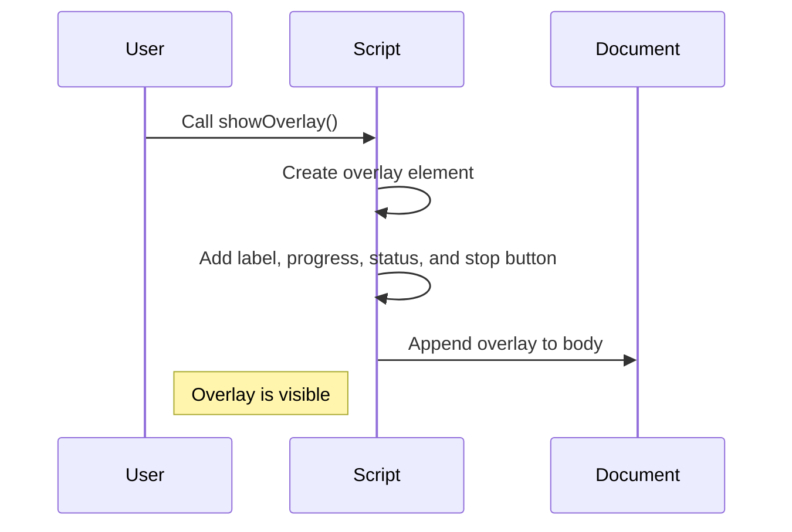

# Chapter 1: Overlay UI

In the previous chapter, we learned about starting the project `fusenlink`. Now, we will dive into the concept of Overlay UI.

### Overlay UI: Solving Visibility Issues

Imagine you are performing a task on LinkedIn that takes a while to complete, like connecting with multiple people. How do you know if it's working or when it's finished? The Overlay UI helps solve this by providing a floating progress indicator with live status messages.

### Key Concepts:
1. **showOverlay(label)**: Displays the overlay with a given label.
2. **updateProgress(processed, total, elapsedSeconds)**: Updates progress display with processed and total count, and elapsed time.
3. **updateStatus(message)**: Updates the status message shown on the overlay.
4. **showSummary(text)**: Displays a summary message and disables the stop button.
5. **hideOverlay()**: Hides and removes the overlay from the screen.

Let's use the `showOverlay` function to display a progress indicator with the label "Connecting":

```javascript
showOverlay("Connecting");
```

This code will create a floating overlay at the bottom right of the page, indicating that a connection process is happening.

### Internal Implementation Overview:

When you call `showOverlay`, it creates an overlay element with the specified label and styling. The progress, status, and stop button areas are also initialized. The overlay is then appended to the document body, making it visible to the user.

We can visualize the process like this in a sequenceDiagram:


To know more about the internal code implementation, refer to the `lib/overlay.js` file.

In the next chapter, we will explore Content Scripts in more detail. Let's proceed to [Chapter 2: Content Scripts](02_content_scripts.md).

---

Generated by [AI Codebase Knowledge Builder](https://github.com/The-Pocket/Tutorial-Codebase-Knowledge)