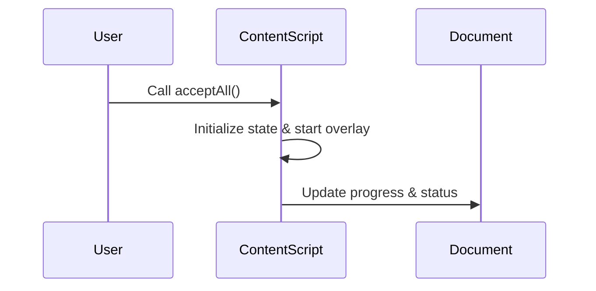

# Chapter 2: Content Scripts

In the previous chapter, we learned about the Overlay UI concept, which helps in providing visual feedback during LinkedIn bulk actions. Now, we will explore Content Scripts, which play a vital role in injecting UI elements into LinkedIn pages and executing bulk actions.

## Motivation
Content Scripts act as mini-programs injected into web pages, such as LinkedIn. They facilitate the automation of repetitive tasks, like accepting or denying multiple invitations, without manual intervention.

### Key Concepts:
1. **Inject UI Elements**: Content Scripts add interactive elements to the LinkedIn page, empowering automated actions.
2. **Execute Bulk Actions**: With Content Scripts, you can seamlessly handle tasks like accepting or ignoring invitations at scale.

Let's delve into how Content Scripts can simplify the process of managing LinkedIn invitations.

### How to Use Content Scripts
To demonstrate the power of Content Scripts, let's consider an example scenario. Suppose you want to automate the process of accepting multiple LinkedIn invitations without manual effort.

```javascript
acceptAll();
```

Above is an example code snippet that triggers the action to accept all pending LinkedIn invitations. This initiates bulk actions, making the process efficient and automated.

### Internal Implementation Overview:
Here's a high-level explanation of what happens internally when calling the `acceptAll` function:


The actual logic and implementation details reside in the `invitations.js` file. Let's explore how the code handles accepting invitations internally.

By following the code structure in `invitations.js`, you can understand how the functionality is implemented to interact with LinkedIn pages and manage bulk actions seamlessly.

### Conclusion
Content Scripts serve as a powerful tool for automating repetitive tasks on LinkedIn, enhancing productivity and efficiency. In the next chapter, we will discuss the Background Script, which plays a crucial role in handling communication and data management.

Proceed to [Chapter 3: Background Script](03_background_script.md) for more insights into managing background functionalities.

---

Generated by [AI Codebase Knowledge Builder](https://github.com/The-Pocket/Tutorial-Codebase-Knowledge)