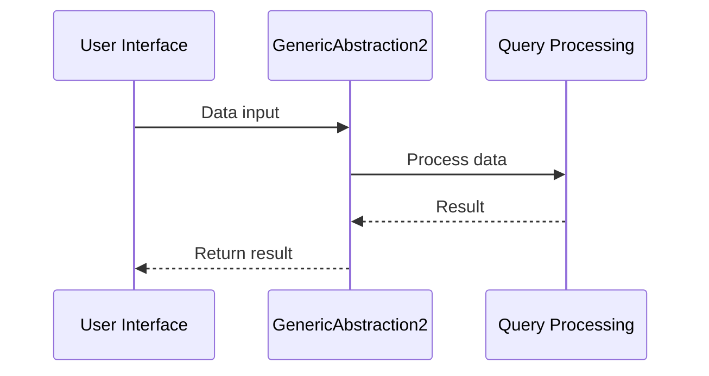

# Chapter 2: GenericAbstraction2

In the previous chapter, we explored `GenericAbstraction1` in the `fusenlink` project.

## Solving Core Functionality with GenericAbstraction2

Imagine you need to perform essential operations without accessing external sources - that's where `GenericAbstraction2` steps in. It's like having a reliable helper for specific tasks.

### Key Concepts
1. **Placeholder Abstraction**: A tool that stands in for required functionality.
2. **Cache-Only Mode**: Operating solely on cached data without external queries.

### Using GenericAbstraction2

To use `GenericAbstraction2`, you can pass in your data and expect it to support specific functionality. Let's see a basic example:

```javascript
const data = {
  key: 'value'
};

const result = GenericAbstraction2.process(data);
```

Here, `GenericAbstraction2` processes the provided data and returns a result.

### Internal Workings

Let's peek behind the curtain with a simple sequence diagram:



Internally, `GenericAbstraction2` hands the data to the Query Processing module for processing before returning the result.

### Conclusion

In this chapter, we delved into `GenericAbstraction2` in `fusenlink`, a tool for cache-only functionality. It's like having a task-specific helper in your toolkit. Next, let's explore more about `GenericAbstraction2`.

---

Continue to the next chapter: [GenericAbstraction2](02_genericabstraction2.md)

---

Generated by [AI Codebase Knowledge Builder](https://github.com/The-Pocket/Tutorial-Codebase-Knowledge)