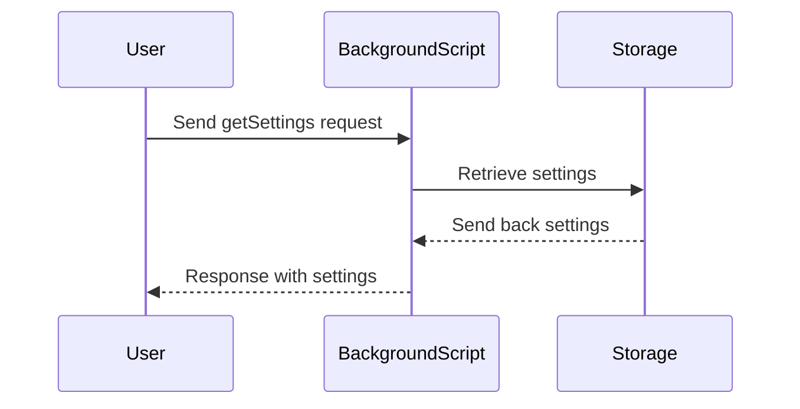

# Chapter 3: Background Script

In the previous chapter, we explored Content Scripts and how they enable automation of tasks on LinkedIn pages. Now, let's delve into Background Scripts, which play a crucial role in managing communication and data in the `fusenlink` project.

## Background Script: Managing Background Functionalities

Background Scripts, represented by `background.js`, serve as service workers that run persistently in the background. This central messaging hub handles cross-script communication and manages settings independently of the UI.

### Key Concepts:
1. **Service Worker**: Acts as a persistent service that can handle events, manage state, and communicate with other scripts in the extension.
2. **Central Messaging Hub**: Facilitates communication between Content Scripts, Overlay UI, and Options Page for seamless interaction and data management.

To demonstrate the importance of Background Scripts, let's consider a scenario where you need to retrieve and update the extension settings from a central location.

### How to Use Background Script
To retrieve settings from the Background Script, you can send a message from another script like the Options Page or Content Scripts:

```javascript
// Request settings from Background Script
chrome.runtime.sendMessage({ action: 'getSettings' }, (response) => {
  console.log('Current settings:', response);
});
```

In this code snippet, we send a message to the Background Script requesting the current settings. The Background Script retrieves these settings and sends them back for us to use.

### Internal Implementation Overview:
Here's a step-by-step breakdown of what happens when requesting settings from the Background Script:


For a deeper understanding of how this works internally, refer to the code in the `background.js` file where message handling and settings management are implemented.

### Conclusion
Background Scripts are essential for managing data and communication between different components of the `fusenlink` extension. By leveraging the Background Script, you can ensure seamless interactions and efficient information exchange within the extension.

Proceed to [Chapter 4: Settings](04_settings.md) to learn how to customize extension settings effectively.

--- 

Output is for educational purposes. Please review the code to ensure compatibility and accuracy with the `fusenlink` project.

---

Generated by [AI Codebase Knowledge Builder](https://github.com/The-Pocket/Tutorial-Codebase-Knowledge)