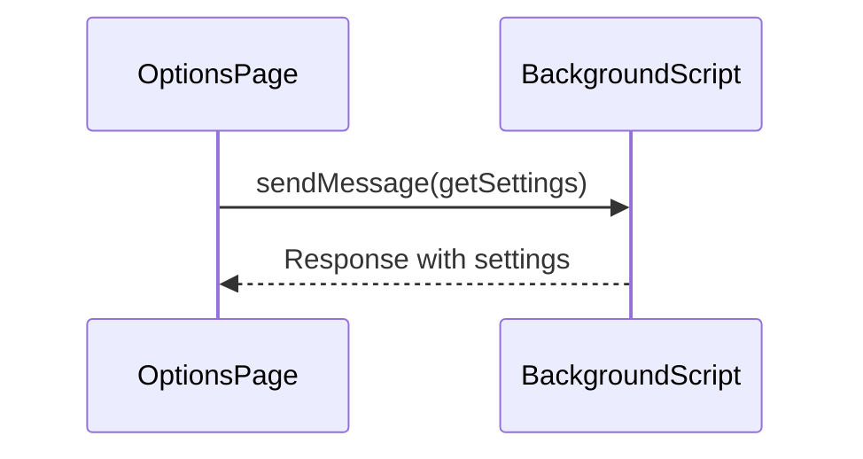

 # Chapter 5: Messaging

In the previous chapter, we learned how to [customize settings](04_settings.md) in the `fusenlink` extension. Now, let's explore the concept of Messaging, which is crucial for coordinating communication between different components.

## Why Messaging?

The `fusenlink` extension has multiple moving parts - the background script, content scripts, and options page. These components need to seamlessly communicate with each other to function properly. 

For example, the options page needs to retrieve settings from the background script. Or a content script might need to update settings that are managed by the background script.

**Messaging** enables this inter-component communication in a simple yet powerful way.

### Key Concepts

There are two key concepts to understand about Messaging:

1. **sendMessage**: Used to send a message from one component to another.

2. **onMessage**: Listens for incoming messages to a component.

Let's look at a simple example to see Messaging in action.

### Retrieving Settings from Background

Suppose we want to retrieve the current settings from the background script in our options page. 

Here is how we can achieve that using Messaging:

```js
// Send message to background script
chrome.runtime.sendMessage({action: 'getSettings'}, (response) => {
  // Handle response  
});
```

This code sends a `getSettings` message to the background script. 

The background script listens for this message and sends back the settings in the response. We can then handle the response to get the settings.

So in this example, `sendMessage` is used to initiate the request, while the background script uses `onMessage` to listen and respond.

### How Messaging Works Internally

Here is a simplified sequence diagram showing what happens internally when we send a message:



The `sendMessage` method communicates with the background script, which has an `onMessage` listener. This listener handles the request and sends back a response.

The key pieces that enable this are:

1. `chrome.runtime.onMessage` in `background.js` to listen for messages.

2. `chrome.runtime.sendMessage` in `options.js` to send the message.

The Messaging API provides the plumbing to connect these components.

### Conclusion

Messaging is a simple yet powerful concept that enables different components of `fusenlink` to communicate. It acts as the nervous system, transmitting signals across the extension.

In the next chapter, we will bring together everything we have learned to [build a complete workflow](06_complete_workflow.md).

---

Generated by [AI Codebase Knowledge Builder](https://github.com/The-Pocket/Tutorial-Codebase-Knowledge)