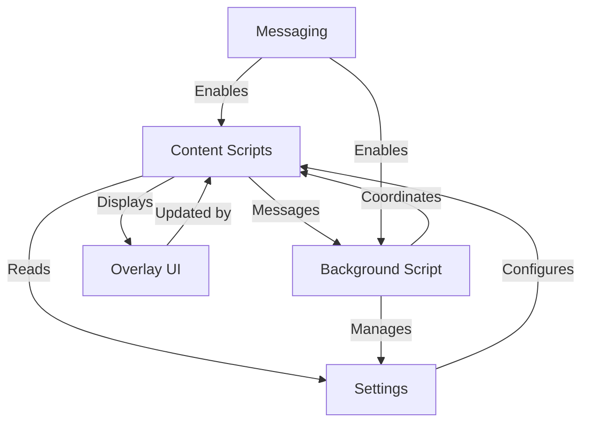

# Tutorial: fusenlink

The LinkedIn Bulk Actions browser extension provides automated batch processing functionality on LinkedIn pages such as accepting/denying multiple connection invitations and sending connection requests to search results profiles. It injects UI buttons that trigger bulk actions and displays an overlay for progress. The background script, content scripts, settings, and overlay UI components coordinate to enable this.

**Source Repository:** [None](None)

## Chapters

1. [Overlay UI](01_overlay_ui.md)
2. [Content Scripts](02_content_scripts.md)
3. [Background Script](03_background_script.md)
4. [Settings](04_settings.md)
5. [Messaging](05_messaging.md)

---

Generated by [AI Codebase Knowledge Builder](https://github.com/The-Pocket/Tutorial-Codebase-Knowledge)